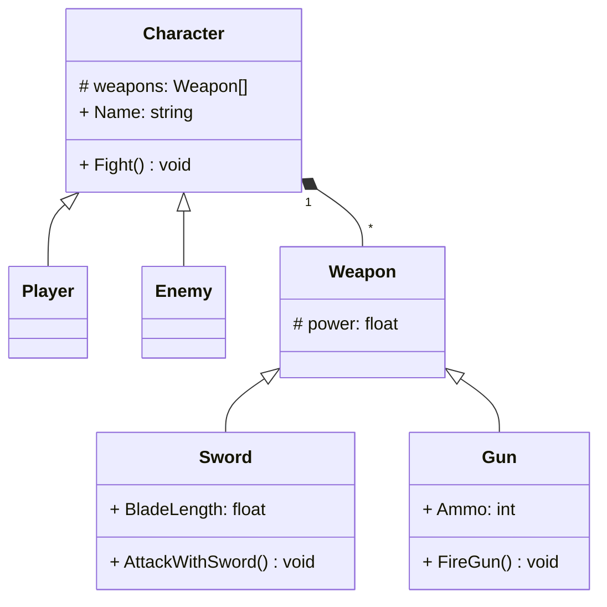

```mermaid
classDiagram
    class Character{
        # weapons: Weapon[]
        + Name: string

        + Fight() void
    }

    class Player{

    }

    class Enemy{

    }

    Character <|-- Player
    Character <|-- Enemy

    class Weapon{
        # power: float

    }

    class Sword{
        + BladeLength: float

        + AttackWithSword() void
    }

    class Gun{
        + Ammo: int

        + FireGun() void
    }

    Weapon <|-- Sword
    Weapon <|-- Gun

    Character "1" *-- "*" Weapon
```